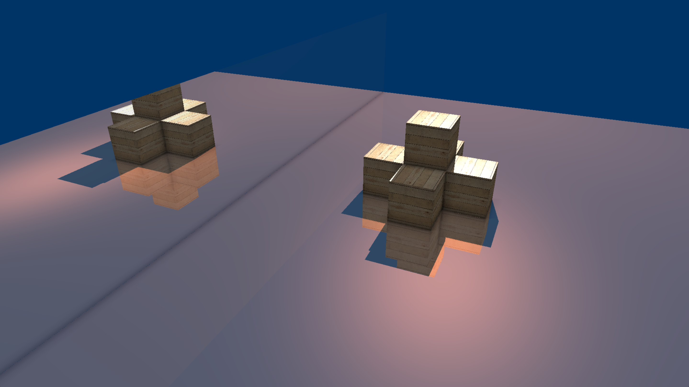
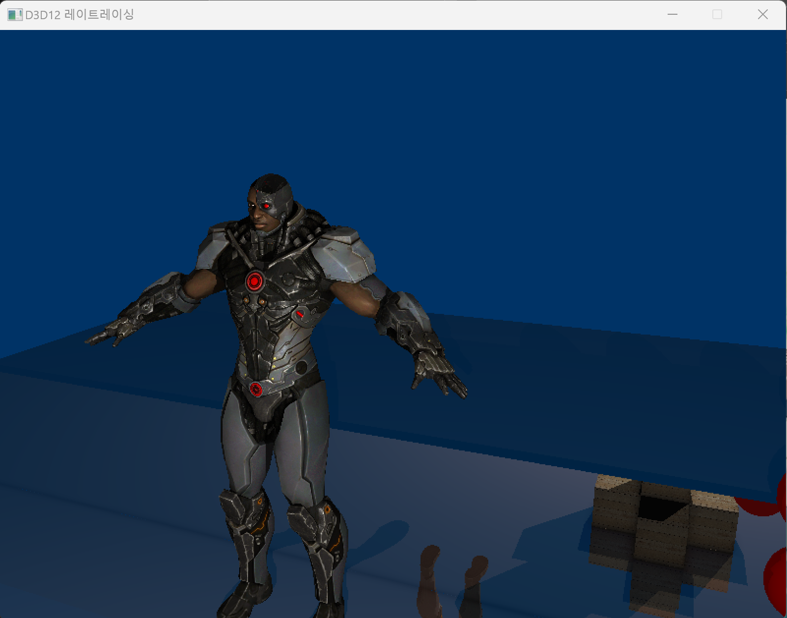
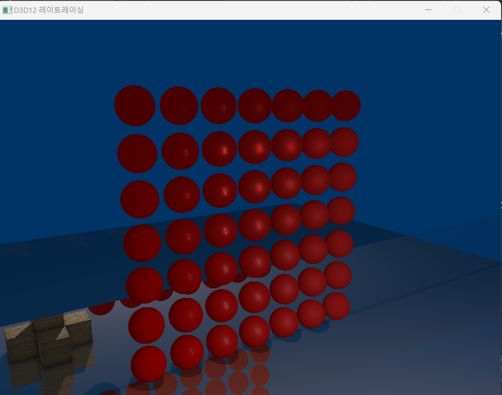

# DirectX12_DXR_Renderer
This application is DirectX12 Toy Renderer Using basic DXR Ray tracing   
[YouTubeLink](https://www.youtube.com/watch?v=3sq5kmFZCIY)

# Project Build
1. Clone This Repository
```
git clone repository
```
2. Open ```DirectX12_DXR.sln```
3. Build And Run(RTX Graphic Hardware Required)

# Control
`w` : front  
`a` : left  
`s` : back  
`d` : right  
`q` : down  
`e` : up  

`mouseX` : rotate camera Y axis
`mouseY` : rotate camera X axis


# Develop Schedule
(22'07'23 ~ 22'08'22)  
* 22'07'28 : Single 2D Triangle Rendering
* 22'08'03 : Multiple Renderables Rendering
* 22'08'05 : 3D Cube Rendering
* 22'08'06 : 3D Camera
* 22'08'07 : Point Light And Phong Shading
* 22'08'11 : Raytracing Shadow(Hard Shadow)
* 22'08'15 : Texturing
* 22'08'18 : Raytracing Reflection(Mirror)
* 22'08'22 : Raytracing Ambient Occlusion

(23'04'19 ~ present)
* 23'04'20 : Assimp Model Loading
* 23'04'22 : Normal Map
* 23'05'01 : PBR Shading

# Main Features

## Shadow Ray
When shading hit point, Every hit point trace 1 shadow ray to light source.

## Reflection Ray
When shading hit point, Every hit point trace 1 reflection ray to reflected direction. This TraceRay function call is recursive, So reflected ray is also trace 1 
reflection ray to reflected direction. This recursive call is infinite unless miss shader calls or recursive depth reach to max_depth(constant).

## Ambient Occlusion Ray
  

When shading hit point, Every hit point trace 4 Ambient Occlusion ray to pre defined direction in hemisphere space. If many occlusion ray hit in near point, that hit point will be shaded more darker.  

## Model Loading
  

Model Loading Using Assimp Open Source.(1 BLAS per 1 Mesh)

## PBR Shading
  

PBR Shading using lambertian, cook-torrance brdf


# Reference
- [MS D3D12 Samples](https://github.com/microsoft/DirectX-Graphics-Samples)
- [SIGGRAPH 2018 DXR Tutorial](http://intro-to-dxr.cwyman.org/)
- [LearnOpenGL PBR](https://learnopengl.com/PBR/Lighting)
