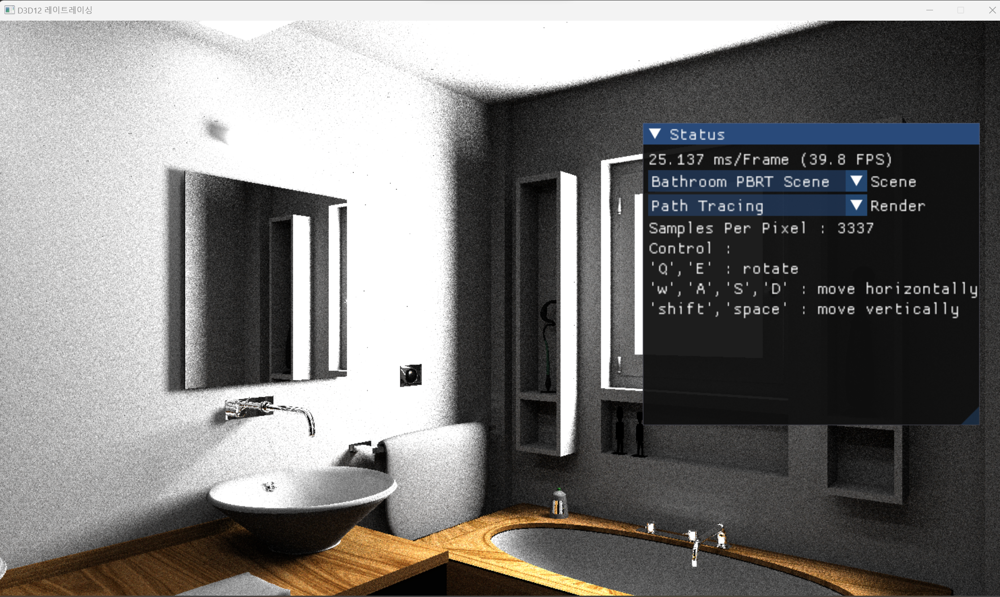
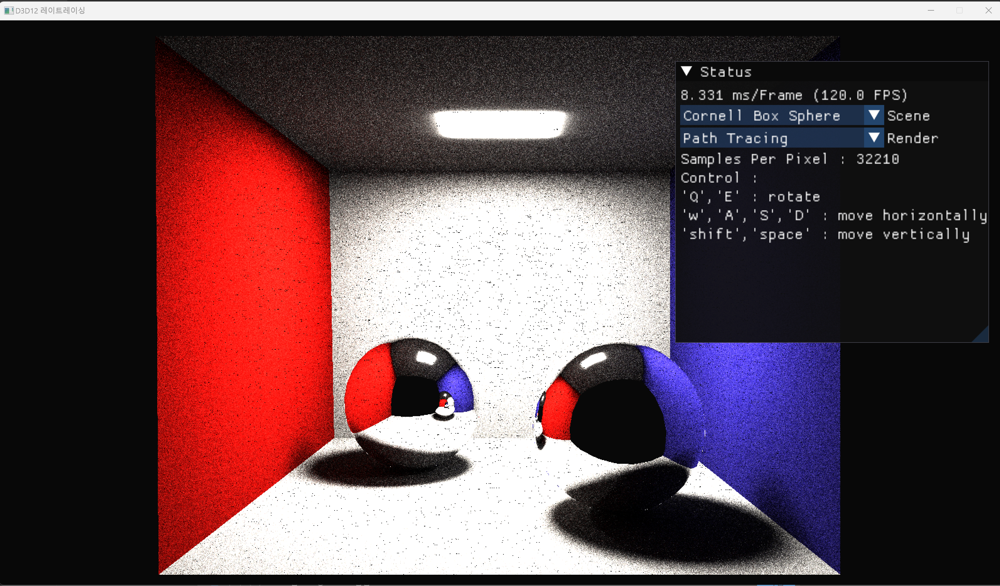
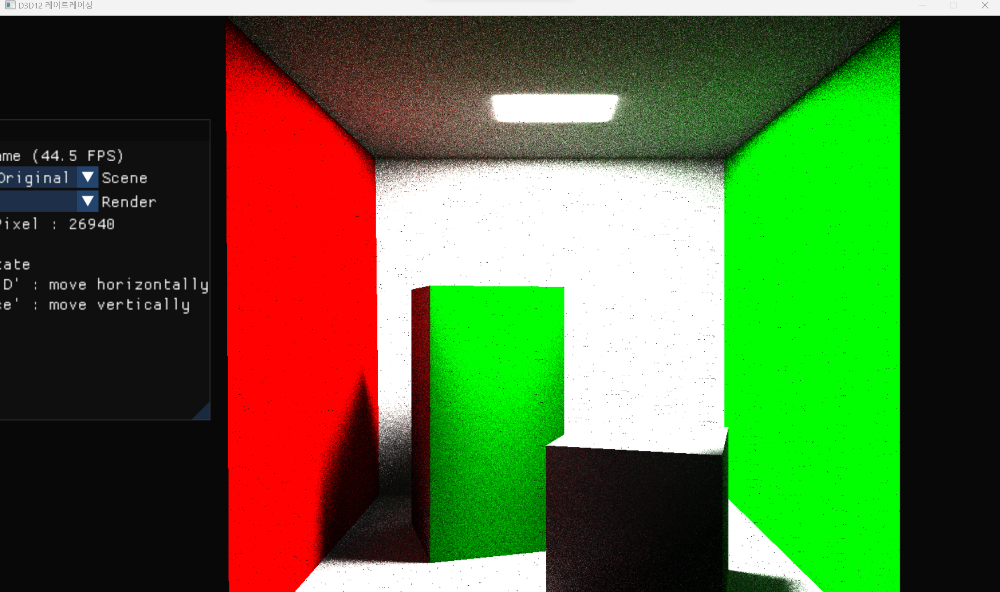

# 프로젝트 소개
DirectX12 DXR로 구현한 레이트레이싱 렌더러입니다.  

[220920 유튜브 영상](https://www.youtube.com/watch?v=3sq5kmFZCIY)  
[240118 유튜브 영상](https://www.youtube.com/watch?v=p5pKfETVxYI)  

# 프로젝트 빌드 & 실행방법
1. 레포지토리 클론
```
git clone https://github.com/yuntaewoong/DirectX12_DXR_Renderer.git
```
2. PBRT 씬파일 다운을 위해서 `Setup.ps1` 실행    
3. ```DirectX12_DXR.sln``` 파일 오픈
4. 솔루션 빌드 후 실행(```Game```프로젝트를  실행프로젝트로 설정)

# 조작 방법
`w` : 앞으로 이동  
`a` : 왼쪽으로 이동  
`s` : 뒤로 이동  
`d` : 오른쪽으로 이동  
`q` : 반시계방향 회전  
`e` : 시계방향 회전  
`shift` : 카메라 하강  
`space bar` : 카메라 상승  


# 개발 진척도
## (22'07'23 ~ 22'08'22)  
* 22'07'28 : 2D 삼각형 렌더링
* 22'08'05 : 3D 큐브 렌더링
* 22'08'06 : 3D 카메라이동 구현
* 22'08'07 : Point Light, Phong Shading구현
* 22'08'11 : Raytracing Hard Shadow구현
* 22'08'15 : 텍스처 로딩 구현
* 22'08'18 : Mirror Reflection 구현
* 22'08'22 : Raytracing기반 AO구현

## (23'04'19 ~ 23'05'07)
* 23'04'20 : Assimp 오픈소스를 이용한 모델로딩 구현
* 23'04'22 : 노말맵 로딩 구현
* 23'05'01 : 직접광에 의한 PBR Shading구현

## (23'12'14 ~ )
* 23'12'14 : Imgui 오픈소스를 이용해서 GUI추가
* 23'12'19 : Real Time Raytracing/Path Tracing 2가지 렌더링 모드를 선택할 수 있게 구현
* 23'12'27 : GPU에서 사용할 수 있는 CPU기반 Uniform 분포 난수 생성기 구현(c++ 난수 엔진인 mt19937 이용)
* 24'01'04 : `.pbrt` 형식의 고퀄리티 씬파일을 로딩하기 위해서 PBRT Parser오픈소스를 프로젝트에 추가
* 24'01'10 : Material에 Emissive속성 추가
* 24'01'12 : Uniform 랜덤샘플링을 이용한 Monte Carlo Path Tracing구현
* 24'01'14 : Path Tracing에서 거울반사 구현, pbrt의 material을 적절하게 로딩하도록 구현
* 24'01'17 : 각종 편의기능(런타임 씬전환, SPP출력, 조작방법 출력) 구현


# 기능 소개

## 리얼타임 레이트레이싱
### 최종 구현목표
현세대 GPU에서 Real Time에 렌더링할 수 있는 레이트레이싱 기법들을 이용한 고퀄리티 렌더링
### 현재 구현된 기능들


- 직접광에 의한 PBR Shading
 


- Ray Tracing기반 Ambient Occlusion


## 패스 트레이싱
### 최종 구현목표
.pbrt의 레퍼런스 씬들의 결과물을 완벽하게 재현할 수 있는 GPU기반 패스 트레이서 구현

### 현재 구현된 기능들


- `.pbrt` 씬 파일 렌더링(일부 Material만 구현)






- .obj 파일 렌더링

# Reference
- [MS D3D12 Samples](https://github.com/microsoft/DirectX-Graphics-Samples)
- [SIGGRAPH 2018 DXR Tutorial](http://intro-to-dxr.cwyman.org/)
- [LearnOpenGL PBR](https://learnopengl.com/PBR/Lighting)
- [Ray Tracing in One Weekend](https://raytracing.github.io/books/RayTracingInOneWeekend.html)
